[](https://github.com/hacs/integration)

Этот репозиторий содержит настраиваемый компонент для Home Assistant для отображения данных со счетчиков, зарегистрированных в сервисе [Тайпит](https://cloud.meters.taipit.ru/).

Работа интеграции проверена на однофазных счетчиках [НЕВА МТ 114 AS WF1P](https://www.meters.taipit.ru/catalog/neva/odnofaznyie-schetchiki/mnogotarifnyie/2929/) и трехфазных [НЕВА МТ 315](https://www.meters.taipit.ru/catalog/neva/trehfaznyie-schetchiki/mnogotarifnyie/3281/)

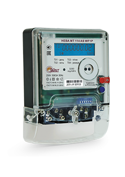 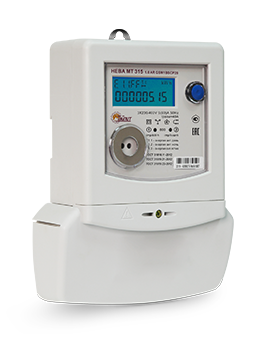

# Установка

**Способ 1.** Через [HACS](https://hacs.xyz/) > Интеграции > Добавить пользовательский репозиторий > https://github.com/lizardsystems/hass-taipit/ > **Taipit** > Установить

**Способ 2.** Вручную скопируйте папку `taipit` из [latest release](https://github.com/lizardsystems/hass-taipit/releases/latest) в директорию `/config/custom_components`.

# Настройка

> [Настройки](https://my.home-assistant.io/redirect/config) > Устройства и службы > [Интеграции](https://my.home-assistant.io/redirect/integrations) > [Добавить интеграцию](https://my.home-assistant.io/redirect/config_flow_start?domain=taipit) > Поиск `Taipit`

или нажмите:

[](https://my.home-assistant.io/redirect/config_flow_start?domain=taipit)

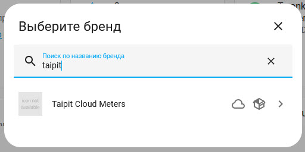

Появится окно настройки.

Укажите логин и пароль учетной записи на сервисе [Тайпит](https://cloud.meters.taipit.ru/).

Для тестирования вы можете использовать учетную запись демонстрационного пользователя (логин guest@taipit.ru и пароль guest). 

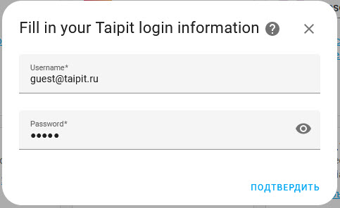

Если вы ввели правильно логин и пароль, то появится сообщение об успешном окончании настройки.

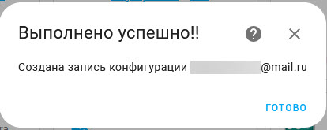

Вы можете подключить сразу несколько учетных записей, в каждой из которых может быть несколько счетчиков.

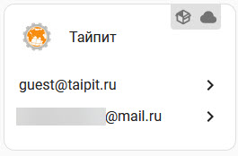

Щелкнув на одну из них можно посмотреть устройства ли объекты созданные для этой учетной записи.

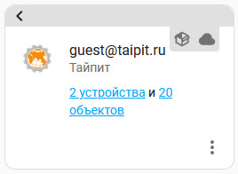

Устройством будет каждый отдельный зарегистрированный счетчик.

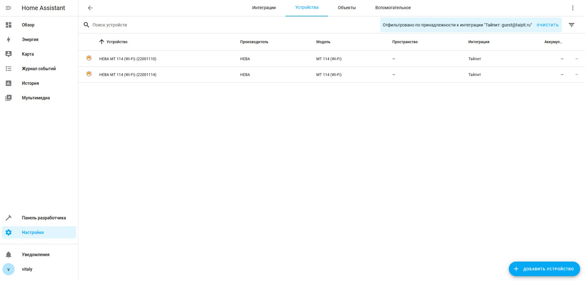

Объекты для каждого устройства

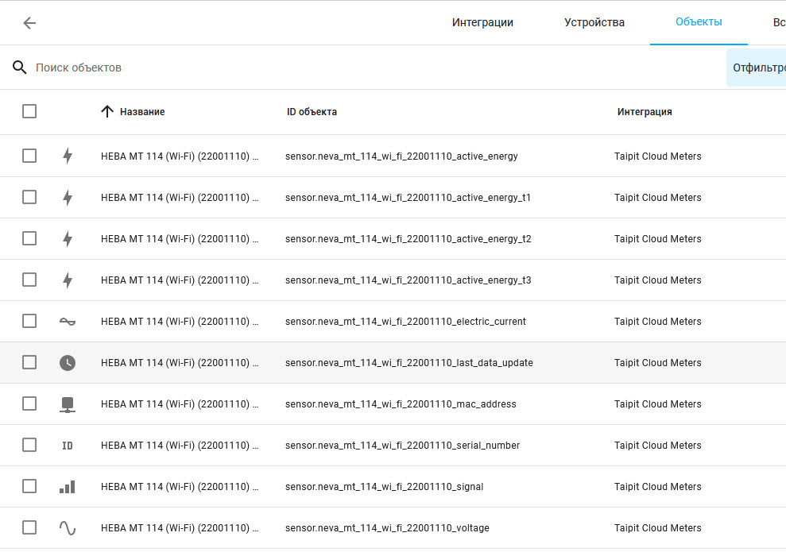

Доступны следующие объекты:
 - Активная энергия (общая потребленная энергия)
 - Активная энергия T1 (можно отключить если не используется двухтарифный план)
 - Активная энергия T2 (можно отключить если не используется двухтарифный план)
 - Активная энергия T3 (можно отключить если не используется трёхтарифный план)
 - Напряжение (для однофазных счетчиков)
 - Ток (для однофазных счетчиков)
 - Коэффициент мощности (cos φ), при наличии (для однофазных счетчиков)
 - Напряжение, ток и коэффициент мощности по каждой фазе (для трёхфазных счетчиков)
 - Последнее обновление данных
 - Серийный номер счетчика
 - MAC адрес модуля Wi-Fi
 - Уровень сигнала модуля Wi-Fi
 - Кнопка для немедленного обновления информации

Общий вид устройства в Home Assistant

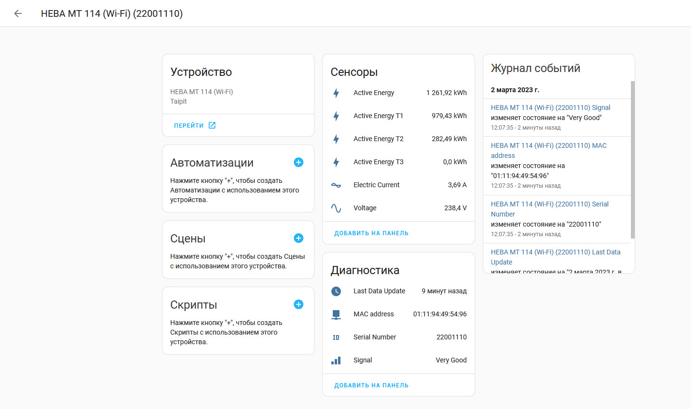

Устройство можно подключить в панель Энергия, для отслеживания расхода ресурсов и их стоимости.

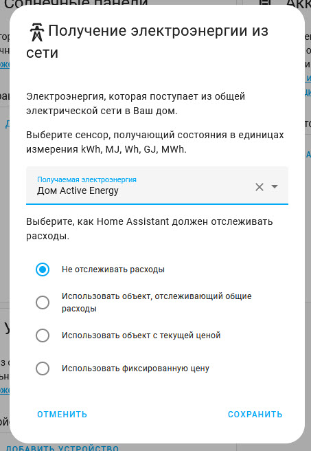

# Перенастройка

Если вам нужно изменить пароль учётной записи, перейдите в настройки интеграции и выберите **Перенастроить**. Удалять и заново добавлять интеграцию не нужно.

# Диагностика

Интеграция поддерживает [диагностику Home Assistant](https://www.home-assistant.io/docs/configuration/troubleshooting/#download-diagnostics). Для загрузки диагностических данных перейдите в настройки интеграции и нажмите **Загрузить диагностику**. Конфиденциальные данные (логин, пароль, токен) автоматически скрываются.

# Алгоритм обновления

Счётчики передают показания в облако каждые 30 минут в фиксированное время (:00 и :30). Интеграция учитывает это и опрашивает облако не по фиксированному таймеру, а сразу после ожидаемого времени передачи с учётом возможного дрейфа часов счётчика (~3 минуты). Это позволяет получать актуальные данные с минимальной задержкой.

# Возникли проблемы?

Включите ведение журнала отладки, поместив следующие инструкции в файл configuration.yaml:
```yaml
logger:
  default: warning
  logs:
    custom_components.taipit: debug
    aiotaipit: debug

```
После возникновения проблемы, пожалуйста, найдите проблему в журнале (/config/home-assistant.log) и создайте [запрос на исправление](https://github.com/lizardsystems/hass-taipit/issues).

# Дополнительная информация

Эта интеграция использует API https://cloud.meters.taipit.ru/.
